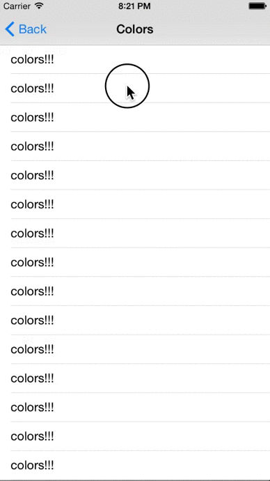
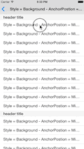
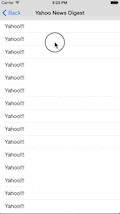
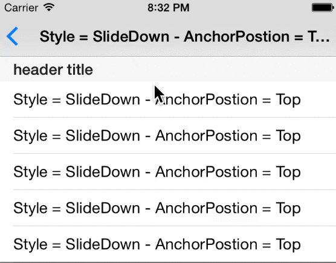
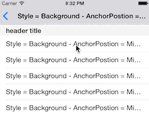
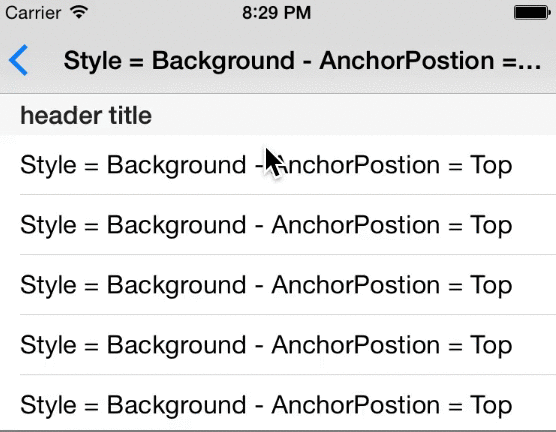
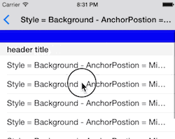
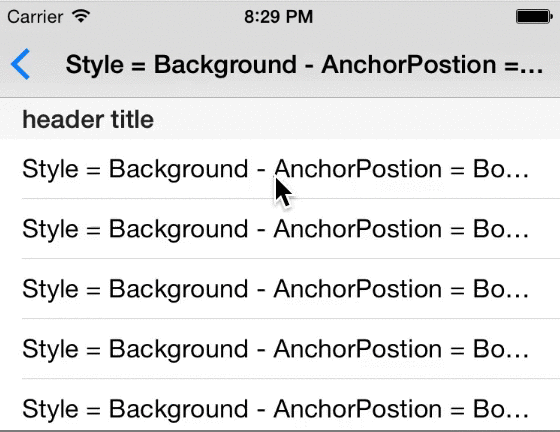

JHPullToRefreshKit
==================

*Abstract base class to easily create custom pull to refresh controls*
  
</img>
</img>
</img>
</img>

All of the above were made with **less than 150 lines of code**. 

####Why Another Pull To Refresh Library?
There are lots of PTR libraries out there but none that fit 100% of my needs. PTR controls are awesome when completed but tedious to make. I made this so I would always be able to jump right into the custom animation, and not having to worry about customization. All you have to do for my implementation is override a few [abstract methods](#subclassing) detailing height, animation duration, and what gets run each [animation cycle](#under-the-hood). 

**My implementation provides:**

* [Add to a UITableView or UIScrollView in one line of code](#adding)
* [Customizable animations and height](#subclassing)
* [Optional use of keyframe, spring,](#animation-options) or [CALayer](#calayer) animations
* [Anchoring of the animated view once it is pulled down past its height](#anchor-options)
* [How the PTR control is presented as it is pulled down](#type-options)
* [Exit animations](#exit)
* [Verbose debugging](#debug)

## <a name="adding"></a>Adding to a UIScrollView

You can add the refresh control to a scroll view in one line after you initialize it. The code in the refreshBlock will be called when the scroll view is pulled past its height.

**Important:** You must call  **endRefreshing** to stop the refresh control. A good place to do this is in the callback of a network request.

```objective-c
-(void) viewDidLoad {
	[super viewDidLoad];
	...
	self.myRefreshControl = [[MyRefreshControl alloc] init];
	[self.myRefreshControl addToScrollView:self.tableView withRefreshBlock:^{
	     [self tableViewWasPulledToRefresh];
	}];
	...
}

-(void)tableViewWasPulledToRefresh {
    [self someBigNetworkRequestWithCallback:^{
    	[self.myRefreshControl endRefreshing];
    }];
}
```

##<a name="subclassing"></a>Subclassing JHRefreshControl

**JHRefreshControl** is an abstract base class, which means there are some functions you need to override. The following methods must be implemented or your app will crash. You can find a section of code to copy and paste in [AbstractFunctionsCopyandPaste.txt](./JHPullToRefreshKit/AbstractFunctionsCopyandPaste.txt) with all the methods for your .m file. 

A great example can be found in [ColorChangeRefreshControl.m](./JHPullToRefreshExampleProj/JHPullToRefreshExampleProj/ColorChangeRefreshControl.m)

####Abstract Class Methods:
```objective-c
// sets the height of the refresh control  
+(CGFloat)height;

//sets the animation duration of each animation cycle for the refresh control.
+(NSTimeInterval)animationDuration;
```
####Abstract Instance Methods:

```objective-c
// use this to setup the refresh control.
// put setup code here instead of init
-(void)setup;

// Used to control UI elements during scrolling
// only called while scroll view is scrolling
// not during PTR animation
-(void)handleScrollingOnAnimationView:(UIView *)animationView
                     withPullDistance:(CGFloat)pullDistance
                        pullRatio:(CGFloat)pullRatio
                         pullVelocity:(CGFloat)pullVelocity;
```
* *pullDistance:* offset of the scroll view
* *pullRatio:* ratio of the offset to the height of the refresh control
* *pullVelocity:* how fast the scroll view is being pulled  


```objective-c
// Set refresh animation to correct state before a new cycle begins
// Called before each animation
-(void)setupRefreshControlForAnimationView:(UIView *)animationView;

// UI changes to be animated continuously 
// until endRefreshing is called. 
-(void)animationCycleForAnimationView:(UIView *)animationView;
```  

####Other Useful Properties and Methods:

```objective-c
// manual refresh
// call in view controller
-(void)forceRefresh;

// called to end the animation
// call in view controller
-(void)endRefreshing;

// should reset UI elements here
// called after refresh control finishes and is hidden
// override in subclass
-(void)resetAnimationView:(UIView *)animationView;

// called to add a subview to the animation view
// important to only add subviews in this manner
// call in subclass to setup refresh control
-(void)addSubviewToRefreshAnimationView:(UIView *)subview;

// sets the animation delay
// override in subclass
+(NSTimeInterval)animationDelay;

//getters
@property (atomic, readonly, getter=isRefreshing) BOOL refreshing;
@property (nonatomic, readonly) CGFloat height;
@property (nonatomic, readonly) NSTimeInterval animationDuration;
@property (nonatomic, readonly) NSTimeInterval animationDelay;
```

##<a name="under-the-hood"></a>Under The Hood
 
**What is this 'animation cycle' you speak of??**  

An animation cycle is UI code that is repeated inside an animation block. Real life examples are one spin of a yaks head on the yik yak app, or one color change on the snapchat app.

**So Whats really going on??**  

The refresh control has a subview that runs animations. When the refresh control is pulled, it sets up the animation view for a cycle (makes sure the yaks head is at the correct start angle), and then runs the animation (spins the yaks head once.) It then checks to see if **endRefreshing** has been called. If it has, it exits. If it has not, it sets up and then runs the animation again (and continues this pattern until **endRefreshing** is called).  


The process below runs continuously from the time that the scroll view is pulled to refresh to the time that **endRefreshing** is called.  

```
 setupRefreshControlForAnimation
 -> animate [ animation cycle ]
    -> completion [animation cycle finished]
        -> if refreshing:
            recurse (another cycle)
        -> else:
            refreshing ended 
            -> [completion animation] 
            -> reset animation view
``` 

###<a name="debug"></a>Debugging

If you want to debug the above process set the **JHPTR\_DEBUG\_FLAG** to *YES* in [JHPullToRefreshKit.h](./JHPullToRefreshKit/JHPullToRefreshKit.h). This will provide verbose output that you can use to see what functions are being called while using a subclass of *JHRefreshControl* or *JHLayerAnimationRefreshControl*.

##Customization

###Variables

####<a name="type-options"></a> JHRefreshControlType
This is how the refresh control is presented when the scroll view is scrolling down (While offset < height). Must be set in **initWithType:**. Defaults to *SlideDown* if a simple **init** is called.

* *JHRefreshControlTypeSlideDown:* the refresh control will slide down with the scroll view as it scrolls.
<div>
</img>
</div>

* *JHRefreshControlTypeBackground:* the refresh control is behind the scroll view and becomes uncovered as the scroll view is scrolled down. 
<div>
</img>
</div>

```objective-c
MyRefreshControl *refreshControl = [[MyRefreshControl alloc] initWithType:JHRefreshControlTypeSlideDown];
```

####<a name="anchor-options"></a> JHRefreshControlAnchorPosition

This is how the animation view is anchored when the scroll view has been scrolled down past its height. (While offset > height). Defaults to *Top*.

* *JHRefreshControlAnchorPositionTop:* The animation view will stick to the top.
<div>
</img>
</div>

* *JHRefreshControlAnchorPositionMiddle:* The animation view will stretch as the scroll view offset increases and stick in the middle. 
<div>
</img>
</div>

* *JHRefreshControlAnchorPositionBottom:* The animation view will stick to the bottom.
<div>
</img>
</div>

```objective-c
self.anchorPosition = JHRefreshControlAnchorPositionTop;
```

####<a name="animation-options"></a> JHRefreshControlAnimationType

This determines the type of animation block that an animation cycle is run in.

* *JHRefreshControlAnimationTypeDefault:* Animation cycle runs inside normal <a>[UIView animationWithDuration:...]</a> block.
* *JHRefreshControlAnimationTypeKeyFrame:* Animation cycle runs inside <a>[UIView animateKeyframesWithDuration:...]</a> block. This means that you should call <a>[UIView addKeyframeAnimationWithRelativeStartTime:...]</a> inside your <a>animationCycleForRefreshView:</a> function.
* *JHRefreshControlAnimationTypeSpring:* Animation cycle runs inside <a>[[UIView animateWithDuration:
                          delay:
                            usingSpringWithDamping: 
                            initialSpringVelocity:...]</a> block.

```objective-c
self.animationType = JHRefreshControlAnimationTypeDefault;
```

You can also add animation **UIViewAnimationOptions** for these animations. 

```objective-c
self->animationOptions = UIViewAnimationOptionCurveEaseInOut;
```


###<a name="exit"></a> Exit Animations

To add an exit animation like the Yahoo news Digest example I provide, override the following function. The exit animation will be called after **endRefreshing** is called, and before the refresh control is resigned. Make sure to call **completion()** when you are done so the refresh control knows to resign!

**-(void)exitAnimationForRefreshView:(UIView *)animationView withCompletion:(JHCompletionBlock)completion;**  

Below is an example for a *Fade to black* exit animation:

```objective-c
-(void) exitAnimationForRefreshView:(UIView *)animationView withCompletion:(JHCompletionBlock)completion {
    [UIView animateWithDuration:1.0 animations:^{
        self.backgroundColor = [UIColor blackColor];
        self.mySubview.alpha = 0.0;
    } completion:^(BOOL finished) {
        [self.mySubview removeFromSuperview];
        completion();
    }];
}

```

##<a name="calayer"></a> CALayer Animations

Some animations are better done using CABasicAnimations. A good example of this is rotating >= 360 degrees. If you want to spin a view 450 degrees, UIView animation blocks will only rotate it 90 degrees. To have a refresh control that performs CABasicAnimations you must subclass **JHLayerAnimationRefreshControl** and override one more abstract method. 

**-(CALayer *) targetLayer;** sets the layer that you want animated.  

To add animations to this layer, simply call:  
**-(void)addCABasicAnimationWithKeyPath:(NSString *)keyPath fromValue:(CGFloat)fromValue toValue:(CGFloat)toValue;**  

A good example is in the Yahoo News Digest Example I provided. To spin the dots, I call the above function in **setup**.  

```objective-c
[self addCABasicAnimationWithKeyPath:@"transform.rotation.z" fromValue:0.0 toValue:2*M_PI];
```

This ensures that the layer I return in **targetLayer** will be rotated 360 degrees each animation cycle. 

Note that **setupRefreshControlForAnimationView:** and **animationCycleForAnimationView:** do not need to be overriden when subclassing JHLayerAnimationRefreshControl. You can, however, override thos functions if there are other UIView animations you would like to execute. 

##Delegate

There are some delegate methods your view controller or scroll view can conform to. 

```objective-c
self.myRefreshControl.delegate = self;
```

```objective-c
@protocol JHRefreshControlDelegate <NSObject>

-(void)refreshControlDidStart:(JHRefreshControl *)refreshControl;
-(void)refreshControlDidEnd:(JHRefreshControl *)refreshControl;

@optional
-(void)refreshControlDidStartAnimationCycle:(JHRefreshControl *)refreshControl;
-(void)refreshControlDidEndAnimationCycle:(JHRefreshControl *)refreshControl;

@end
```

##Contact Info && Contributing

Feel free to email me at [jhurray33@gmail.com](mailto:jhurray33@gmail.com?subject=JHPullToRefreshKit). I'd love to hear your thoughts on this, or see examples where this has been used.

[MIT License](./LICENSE)

